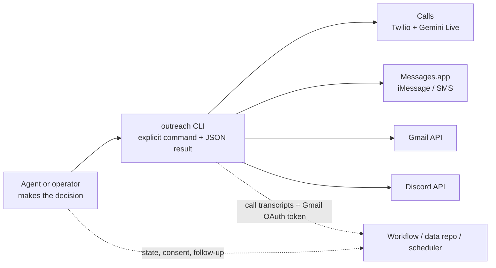

# Outreach

[](skills/outreach/SKILL.md) [](skills/outreach/SKILL.md) [](#command-map) [](#requirements)

**A deliberately narrow interface for reaching real people once an agent or operator has already decided what to say, to whom, and why.** It provides calls, iMessage/SMS, Gmail, Discord, and per-channel history—not a campaign engine dressed up as a CLI.

The distinction matters. Outreach takes care of the channel mechanics that are awkward or unsafe to rebuild in every workflow: authenticated Gmail threading, Messages.app delivery checks, a live voice-call bridge, and a small JSON-shaped surface an agent can use predictably. It does not decide who deserves a message, infer consent, maintain a contact database, or quietly chase a reply.

> **The operating rule:** decide and record the work in the workflow layer; use `outreach` only for the explicit communication action or the channel-specific evidence needed to make that decision.

## What it is—and is not

| Outreach does | The calling workflow still owns |
| --- | --- |
| Checks whether each channel is ready | Contact selection, consent, and the reason to reach out |
| Sends one explicit message, email, Discord post, or voice call | Contact records, campaigns, and durable workflow state |
| Reads the requested SMS thread, Gmail thread/search, Discord history, or live-call state | Cross-channel briefings, interpretation, and follow-up policy |
| Manages the local voice daemon and records call transcripts | Retries, reply watchers, timers, and scheduling (for example, through [Sundial](https://github.com/fyang0507/sundial)) |

There are intentionally no campaign commands, contacts, calendar actions, `outreach context`, polling loops, callback agents, or local campaign files. An agent can read and write its own workflow state directly; this tool should stay a sharp boundary around communication infrastructure.

## Architecture in one glance



Calls are the only stateful channel. `outreach call init` starts a local daemon and webhook tunnel, then has that daemon validate the whole call path before reporting ready; `call place` connects Twilio Media Streams to Gemini Live; the remaining call commands inspect, steer, measure, or close that one session. The daemon then stays up until `call teardown`. SMS, Gmail, and Discord commands are direct channel operations.

## Safety and privacy boundaries

This is communication infrastructure, so its constraints are part of the product:

- **No implicit outreach.** A send, post, or call happens only through an explicit command with a recipient and content/objective. The CLI has no automated follow-up or reply-watching loop.
- **Read narrowly.** SMS history is scoped to one phone number; Gmail reads/searches use the requested address, thread, or Gmail query. Address-mode Gmail history returns snippets unless `--verbose` is requested.
- **Check before acting.** `outreach health` reports readiness for the data repo, call daemon, Messages, Gmail, and Discord without creating a workspace or sending anything.
- **Treat identity as shareable voice context.** The fields under `identity` in `outreach/config.yaml` can be supplied to the voice agent. Put only information you would be comfortable having the assistant say. Its call instruction forbids pretending to be human and requires it to identify as the operator's assistant when asked.
- **Keep secrets out of source control.** Credentials live in the ignored `.env` file. The Gmail OAuth token is stored in `<data-repo>/outreach/gmail-token.json`, outside this checkout; protect that data repo accordingly. Never put tokens, personal message history, or real recipient details in issues, examples, or commits.
- **Use delivery state honestly.** When `--service` is omitted, SMS selects iMessage or SMS from recent local history (unknown recipients default to SMS), then probes Messages.app's outcome. A failure or timeout is not an invitation to blindly resend.

## Requirements

- A current Node.js runtime (the dependency graph requires Node.js 20 or newer) and npm.
- macOS for the Messages.app channel. SMS history needs Full Disk Access for the terminal/agent host; sending needs the relevant macOS accessibility permission. Messages.app must be signed in.
- Optional channel credentials only for the channels you enable: Twilio + a Google Generative AI key for calls, Gmail OAuth credentials for email, and a Discord bot token/guild for Discord. Voice calls use a local `ngrok` tunnel by default, or a manually supplied public webhook URL.
- An existing data repository for application configuration and call/Gmail artifacts. Outreach deliberately does not scaffold or manage that repository.

## Setup

Clone the repository, create local-only configuration, then verify the channels you intend to use:

```bash
git clone https://github.com/fyang0507/outreach-cli.git
cd outreach-cli
npm install

cp .env.example .env
cp outreach.config.dev.yaml.example outreach.config.dev.yaml
# Edit .env and outreach.config.dev.yaml. Point data_repo_path at an existing workspace.

npm run build
node dist/cli.js health
```

`outreach.config.dev.yaml` is ignored and is useful for a development checkout. In a shared workspace, the normal configuration lives at `<data-repo>/outreach/config.yaml`. The CLI resolves its data repo in this order:

1. `OUTREACH_DATA_REPO`
2. `outreach.config.dev.yaml` beside this checkout (`data_repo_path`)
3. A `.agents/workspace.yaml` found by walking up from the current directory

During development, invoke the compiled CLI as `node dist/cli.js …`. If you install the executable on your `PATH`, use `outreach …` instead. `npm run build` also makes the packaged `outreach` and `contact-operator` skills discoverable from the configured agent workspace when possible; the build still succeeds when no workspace is configured.

### A careful first workflow

Start with an observation, keep the decision in the caller, then make one explicit action:

```bash
# 1. Non-destructive: see which channels are ready and which config was resolved.
node dist/cli.js health

# 2. Read only the email context required for the decision.
node dist/cli.js email history --address "recipient@example.com" --limit 5

# 3. After the calling workflow has approved the message, send it.
node dist/cli.js email send \
  --to "recipient@example.com" \
  --subject "A brief follow-up" \
  --body "Hello — following up on our earlier conversation."
```

For a non-blocking update to an operator, Discord is often the quieter choice:

```bash
node dist/cli.js discord channels list
node dist/cli.js discord post --channel "updates" --silent \
  --body "The requested work is complete; the result is in the run artifact."
```

For voice, start and stop the local call infrastructure deliberately:

```bash
node dist/cli.js call init
node dist/cli.js call place --to +15551234567 \
  --objective "Introduce yourself as an assistant, ask whether this is a good time, then say goodbye."
node dist/cli.js call status --id <callId>
node dist/cli.js call teardown
```

The number above is a placeholder. A real call requires the configured Twilio caller-ID setup; use `--from-twilio` when the Twilio number should be shown, and `--call-operator` only for an intentional escalation to the configured operator.

`call init` is the one place setup problems are meant to surface. After the tunnel and daemon are up, the daemon checks—in its own process, so the result describes what a call will actually use—the required `.env` variables, `outreach/config.yaml`, the rendered voice-agent instruction, the transcripts directory, Twilio authentication, both caller IDs (an unverified caller ID is rejected by Twilio at call time, not at init), a real Gemini Live connection, and a round trip through the public webhook URL that must come back to this daemon. Every check is attempted and a failure never aborts the rest, so one command returns the whole checklist; a check whose prerequisite already failed—and the Gemini probe while a call is in progress—is reported as `skipped` rather than repeating a root cause:

```json
{"status":"ready","webhook_url":"https://….ngrok-free.dev","daemon_pid":12345,
 "preflight":{"ok":true,"checks":[{"name":"env","ok":true,"status":"pass","detail":"all 5 required variables are set"}]}}
```

If any check fails, `init` does not report ready: it exits with an infrastructure error whose payload carries the same report—each failed check with a detail and a hint—kills only the processes that this `init` started, and writes no `runtime.json`. The check runs on a reused daemon too, since a daemon that answers `/health` can still be pointed at a tunnel URL that has since been reissued; on that path a failure leaves the existing daemon and its `runtime.json` in place, so resolve it with `teardown` then `init` before placing a call. Use `--skip-preflight` to bypass validation (it is not recommended; it makes `call place` the place you find out).

Everything the daemon holds is released by `call teardown`. The daemon no longer walks away on its own, so `runtime.json` does not go stale while you are working—but `teardown` is the only thing that removes it, so a crashed or killed daemon leaves the file behind. Every consumer health-checks it rather than trusting it.

## Command map

Operational command results are JSON, making them safe to compose into an agent workflow without parsing decorative terminal output. Run `outreach <command> --help` for the complete option list and inline descriptions.

| Area | Commands | Notes |
| --- | --- | --- |
| Readiness | `health` | Reports data-repo and channel readiness; does not scaffold or send. |
| SMS / iMessage | `sms send --to <number> --body <text> [--service iMessage\|SMS]`<br>`sms history --phone <number> [--limit <n>]` | Defaults to history-informed service selection; messages are sent through Messages.app. |
| Gmail | `email send --subject <text> --body <text> (--to <address>\|--reply-to-id <messageId>) [--cc <addresses>] [--bcc <addresses>] [--no-reply-all] [--attach <paths...>]`<br>`email history (--address <email>\|--thread-id <threadId>) [--limit <n>] [--verbose]`<br>`email search --query <gmail-query> [--limit <n>]` | `--reply-to-id` preserves Gmail threading and defaults to reply-all. |
| Discord | `discord post --body <text> [--channel <id\|name>] [--silent]`<br>`discord channels list`<br>`discord channels create --name <name> [--topic <text>] [--category <id\|name>]`<br>`discord history --channel <id\|name> [--limit <n>] [--after <messageId>] [--before <messageId>] [--since <iso>] [--count]` | Intended for operational updates, not a reply-watching loop. |
| Voice calls | `call init [--tunnel ngrok\|manual] [--webhook-url <url>] [--skip-preflight]` · `call place (--to <number>\|--call-operator) --objective <text> [--from-twilio] [--persona <text>] [--hangup-when <text>] [--max-duration <seconds>] [--wait-for-user]`<br>`call listen --id <callId>` · `call steer --id <callId> --text <note> [--mode nudge\|say]` · `call status --id <callId>` · `call hangup --id <callId>` · `call latency (--id <callId>\|--latest)` · `call teardown [--force]` | `init` validates env, config, Twilio, caller IDs, Gemini, and the tunnel before reporting ready, and fails instead if any of it is broken. Calls use the local daemon until teardown. `steer` is a live-session control, not a background agent. |

When passing long free text through a shell, quote it so the shell does not expand `$`, backticks, or `!`. If the entire command is itself wrapped in `zsh -lc '…'`, use double-quoted inner values for text containing apostrophes, or run `outreach` directly when its `PATH` is already initialized.

## For agents and contributors

The README is the human overview. The packaged skill tree is the agent-facing operating manual:

- [`skills/outreach/SKILL.md`](skills/outreach/SKILL.md) — when the utility is appropriate and the canonical command surface.
- [`skills/outreach/call.md`](skills/outreach/call.md), [`sms.md`](skills/outreach/sms.md), [`email.md`](skills/outreach/email.md), and [`discord.md`](skills/outreach/discord.md) — channel-specific behavior and caveats.
- [`skills/contact-operator/SKILL.md`](skills/contact-operator/SKILL.md) — a separate policy for when a headless agent should interrupt an operator; it prefers the quietest adequate channel.
- [`AGENTS.md`](AGENTS.md) and [`CLAUDE.md`](CLAUDE.md) — repository boundaries and contributor guidance.

For development and release checks:

```bash
npm test                       # builds, then runs the unit tests
node dist/cli.js --help
node dist/cli.js health
node dist/cli.js call place --help
node dist/cli.js sms send --help
node dist/cli.js email send --help
npm pack --dry-run
```

Live channel tests can contact real people or services. Run them only with an explicit test target and permission, and always finish a voice test with `call teardown`.

## Repository and license

This is a source-visible operational tool, not a published npm package; `package.json` marks it `private` to prevent accidental publication.

It is released under the [MIT License](LICENSE). You may use, copy, modify, and distribute the software under its terms.
